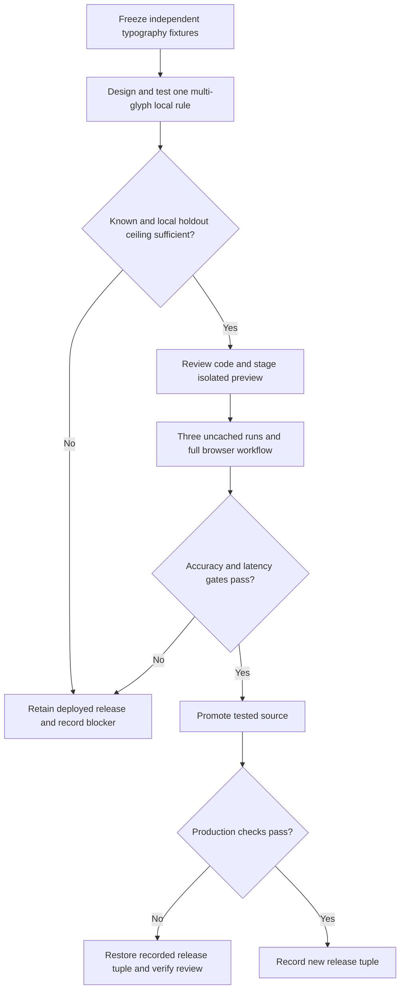

# fix: Validate warning appearance without font-width bias

## Summary

Keep the deployed prototype available. Make its assignment evidence and limitations accurate, then run one bounded attempt to replace the brittle single-glyph boldness guard. Promote a replacement only after independent local, cloud, workflow, latency, and review gates pass.

---

## Problem Frame

The original [take-home assignment](https://github.com/treasurytakehome-rgb/instructions/blob/main/README.md), preserved in `ASSIGNMENT.md`, requires an uppercase, bold warning heading, useful results in about five seconds, batch support, source documentation, and a working deployed URL. It publishes six qualitative evaluation criteria but no passing score or accuracy percentage. The 38/40 bold and zero regular false-Match thresholds below are our engineering release criteria, not the evaluator's rubric.

The deployed source is `c3ebde8`, recorded in `evidence/partial-release-verification.json`. The unreleased follow-up in `src/appearance.js` fixes OCR colon localization and a kerned serif glyph, but passes only 33/40 bold headings on the newest frozen set. Seven narrow-font bold headings fail locally; six regular headings pass the local guard and still need model judgment. `evidence/appearance-followup-local-2026-09-22.md` records these results. A single `I` stem divided by cap height measures absolute thickness, which confounds narrow bold and wide regular faces.

---

## Requirements

**Assignment-facing**

- R1. Preserve a working standalone prototype and source repository with accurate setup, approach, assumptions, and limitations (see `ASSIGNMENT.md`, Deliverables).
- R2. Keep warning wording, heading capitalization, and heading weight as separately assessable findings; ambiguous evidence remains Review (see `ASSIGNMENT.md`, Jenny interview).
- R3. Preserve application-field comparison, 200 to 300 image batch accounting, obvious error recovery, and useful results in about five seconds on clear labels (see `ASSIGNMENT.md`, Sarah interview).

**Internal release criteria**

- R4. Every named clear-bold regression, including narrow fonts and Georgia 28, receives an automated Match; every known regular regression, including Century, remains non-Match.
- R5. On a newly frozen 40 bold and 40 paired regular family/layout holdout, at least 38 bold images receive a final Match in each of three uncached runs, with zero regular-to-bold Matches.
- R6. Count provider failures, deadlines, invalid responses, and unusable glyphs as unsuccessful verification; report these separately from model disagreement and observed regular weight.
- R7. On warm, uncached clear labels, end-to-end click-to-result p95 across every attempt, including failures and uncertainty, is at most five seconds alongside R5; report successful-only, cold-start, and cache-assisted timings separately.
- R8. Preserve free services, crop-only cloud transfer, server-only credentials, limits, authentication, rate limiting, no image persistence, and a distinct human confirmation state.
- R9. Promote only the tested source, browser bundle, Worker version, and configuration identity after full browser and review verification; retain the current deployment if any gate fails.

---

## Key Technical Decisions

- KTD1. **Run one multi-glyph local-evidence experiment.** Measure several heading strokes with quality checks and normalize by glyph width as well as cap height. This directly targets the narrow-bold and wide-regular split shown by `evidence/appearance-heading-holdout-v2-local.json`. A blanket reduction of the existing 0.17 threshold is excluded.
- KTD2. **Keep the cloud decision rule fixed during this experiment.** Retain the current crop, Qwen and Gemma model pair, strict outputs, deadline, and two-model consensus in `worker/vision.js`. Isolating the local change makes failure attribution possible. A changed prompt or model set requires a separate design and new holdout.
- KTD3. **Treat seen fixtures as development data.** The known set and the first two holdouts have informed repairs. Freeze a third, disjoint family/layout set before tuning, record font identities and image hashes, then evaluate it only after the rule is fixed.
- KTD4. **Keep submission readiness separate from the internal accuracy gate.** The current deployed prototype can be described candidly against the assignment without claiming a published passing grade. The new candidate is a stronger release only if R4 through R9 hold.

---

## High-Level Technical Design

The text finding continues to decide exact warning wording and capitalization. The appearance path locates the heading, checks independent local glyph evidence, then consults both models. Only corroborated results become an automated Match. Human confirmation never changes that status.

---

## Implementation Units

### U1. Correct assignment and release presentation

- **Goal:** Make the current prototype reviewable without implying an unpublished grading threshold or misidentifying production source.
- **Requirements:** R1, R2, R3, KTD4.
- **Dependencies:** None.
- **Files:** `README.md`, `REQUIREMENTS.md`, `evidence/partial-release-verification.json` (reference only), `ASSIGNMENT.md` (reference only).
- **Approach:** Reconcile the stale README release footer with its current banner and release evidence. Present the original qualitative criteria, the working URL and source, observed timings, and the boldness limitation distinctly from the internal 95% gate. Preserve current release evidence rather than rewriting historical observations.
- **Patterns to follow:** Trace each claim to `ASSIGNMENT.md` and the versioned release record.
- **Test expectation:** None for documentation. Verify every revision and deployment claim against recorded source and the live bundle before publication.
- **Verification:** A reviewer can open the repository and app and distinguish what works now, what is unresolved, and what is an internal target.

### U2. Freeze an independent typography benchmark

- **Goal:** Prevent tuning and evaluation from sharing font families or layouts.
- **Requirements:** R4, R5, R6.
- **Dependencies:** None; complete before U3 calibration.
- **Files:** `scripts/freeze-appearance-holdout-v2.py` (pattern), `scripts/verify-appearance-guard.js`, `test/corpus.test.js`, `test/fixtures/generated/` (generated), `evidence/` (new versioned manifest).
- **Approach:** Select 40 clear bold images and 40 paired regular images from unseen families and varied full-label layouts. Record resolved font face identity, ground truth, fixture hashes, and renderer provenance. Reserve known and v1/v2 images for development and regression checks. Do not inspect final verdicts while tuning.
- **Execution note:** Freeze metadata and expected labels before changing the classifier.
- **Patterns to follow:** The current frozen manifest and hash verification in `scripts/verify-appearance-guard.js`.
- **Test scenarios:**
  1. A generated fixture whose bytes change fails hash validation before OCR.
  2. A family or layout reused from development data fails the disjointness check.
  3. Each selected regular image has a bold counterpart with the intended face and identical layout.
  4. Missing or substituted font metadata prevents the set from being called independent evidence.
- **Verification:** The immutable manifest contains 80 visually checked, reproducible full-label images with no development-family overlap.

### U3. Replace the single-glyph veto with bounded local evidence

- **Goal:** Recover narrow bold headings without admitting heavy regular headings as automatic bold evidence.
- **Requirements:** R2, R4, R5, R8.
- **Dependencies:** U2.
- **Files:** `src/appearance.js`, `test/appearance.test.js`, `scripts/verify-appearance-guard.js`.
- **Approach:** Isolate several well-formed heading strokes from the OCR-located crop. Combine cap-height and glyph-width-normalized evidence with explicit sample-quality checks. Require enough independent glyphs; merged, cropped, or conflicting samples remain Review. Permit ordinary antialiasing under a fixed measurement policy and reject only edge uncertainty that prevents reliable measurement. Keep colon recognition separate from weight, retain the run-local cache contract, and do not ask the cloud to override a local veto. Fix the rule using only development fixtures, then freeze it before opening the new holdout.
- **Patterns to follow:** `headingBox`, `strokeEvidence`, `reviewAppearance`, and the existing regular Century veto in `src/appearance.js`.
- **Test scenarios:**
  1. Paired narrow bold and regular headings produce distinct evidence; narrow bold is not rejected solely because its absolute `I` ratio is below 0.17.
  2. Regular Century, Copperplate, Futura, enlarged regular, and bold warning-body decoys are not accepted solely from size, font width, or another region's weight; every local pass still requires cloud corroboration and final false-Match accounting.
  3. Georgia 28 kerning, merged neighbors, wrong OCR symbol boxes, split or absent colon tokens, and small clear headings do not misidentify the sampled strokes.
  4. One bold heading word and one regular word, two competing headings, outlined or shadowed letters, italics, insufficient pixels, and light-on-dark artwork either receive justified evidence or remain Review.
  5. Changed image pixels or local quality evidence invalidate any cached cloud Match; provider failures never enter the cache.
- **Verification:** Named positive regressions have sufficient local evidence; regular candidates and vetoes are recorded for final model evaluation; at least 38 new-holdout bold images pass locally without accepting ambiguous geometry. U4 decides final Match and non-Match outcomes.

### U4. Test final verdicts and the complete workflow

- **Goal:** Establish real accuracy, latency, and workflow behavior on an isolated candidate preview after U3 clears its local ceiling.
- **Requirements:** R3, R5, R6, R7, R8.
- **Dependencies:** U3.
- **Files:** `scripts/prepare-appearance-probe.js`, `scripts/probe-appearance.py`, `test/appearance.test.js`, `test/vision.test.js`, `test/corpus.test.js`, `evidence/` (new versioned results).
- **Approach:** Reproduce installation, tests, and build; run full-runtime autoreview and fix accepted findings. Stage an isolated preview of the reviewed candidate with its existing authentication and a candidate Worker if Worker behavior changed. Run the frozen 80 images through the actual browser, preview proxy, and fixed Worker three times without cache reuse. Record per-image local evidence, model outcomes when available, final status, service errors, and click-to-result stage timings. Count every fixture in every run. Then repeat the sample, semantic decoys, title-case and regular warnings, invalid CSV, corrupt image, stop/restart, stale-result clearing, and a 300-image association audit after the final pipeline change.
- **Patterns to follow:** Existing browser and batch evidence in `evidence/partial-release-verification.json` and `evidence/browser-integrated-300.json`.
- **Test scenarios:**
  1. A locally passing regular heading with both models saying BOLD is still counted as a false Match, never hidden in an uncertainty bucket.
  2. Disagreement, malformed output, quota rejection, timeout, late success, and Worker failure produce Review with distinct failure accounting.
  3. Three uncached runs retain every filename, application association, final status, and timing; no per-run cache leaks between runs.
  4. A 300-image mixed job reconciles all CSV rows and images and retains every reviewed, failed, and remaining result through stop/restart.
  5. Warm uncached clear-label p95 includes every attempt, including failed and uncertain results; successful-only, cold-start, and cached timings are additional reports.
- **Verification:** R5 through R7 hold simultaneously. If they do not, stop promotion and record the specific failing family, failure class, or latency stage.

### U5. Promote and verify only a passing candidate

- **Goal:** Promote the preview-tested improvement without disturbing the current production tuple if verification fails.
- **Requirements:** R1, R8, R9.
- **Dependencies:** U4 passes.
- **Files:** `README.md`, `REQUIREMENTS.md`, `src/appearance.js`, `worker/vision.js` (only if changed), `evidence/` (new review and release records).
- **Approach:** Verify the reviewed source revision and preview bundle still match the passing candidate. Use the `treasury-label-review` repository and Vercel project, never `site`. Promote the identical tested source and record application deployment, bundle hash, Worker version, and configuration identity. Verify anonymous custom-domain inference, crawler exclusions, and the separate main website's portrait and links. Roll back the complete tuple and test a real review if production checks fail. Rerun review and affected preview checks if any release fix changes runtime behavior.
- **Patterns to follow:** The release and rollback records in `evidence/partial-release-verification.json`.
- **Test expectation:** No new unit test solely for documentation or deployment metadata. The preview and production checks above are the required integration verification.
- **Verification:** The public app, public source, README claims, and tested release tuple agree. A failed gate leaves the existing public release in place with a documented limitation.

---

## Scope Boundaries and Decision Rule

This plan preserves the current stack, interface, and free services. It excludes COLA/Azure integration, federal production infrastructure, difficult-photo restoration, a paid model search, and training a new font classifier. Mixed-font or degraded artwork can remain Review; it cannot silently become Match. The third holdout is a bounded decision point, not a target to retune against. If this single multi-glyph method fails, retain the partial release and make a separate design decision before another experiment.

The assignment gives no guarantee of a passing mark. If a submission deadline arrives before the internal appearance gate passes, present the current deployed prototype with its measured limitations. Do not describe the 95% gate as an assignment requirement or claim an evaluator outcome.

---

## Risks and Dependencies

- Browser OCR may produce different glyph geometry from the Node diagnostic. The preview browser result governs the release decision.
- Cloudflare free quota and the 60-request-per-minute limit can interrupt repeated runs. Pace within the free allocation, preserve every attempted result, and count rate limits as unsuccessful verification.
- Forty synthetic font pairs cannot establish real-world typography accuracy. Report family-level results and keep unusual or degraded artwork in Review.
- The five-second target depends on provider queueing. If the full-attempt p95 fails, retain production even when successful-only timing looks fast.
